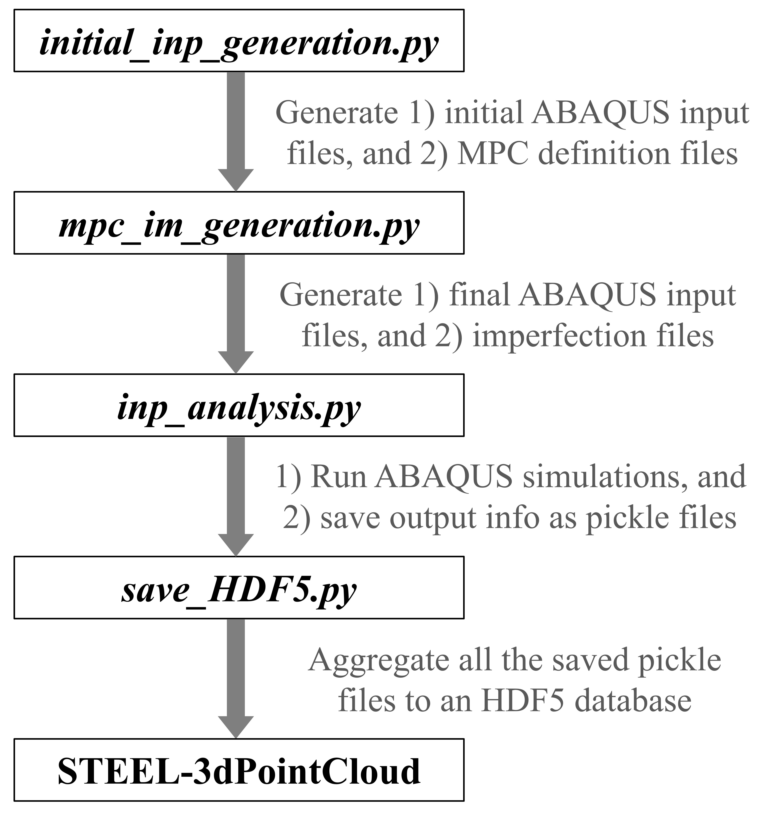

# Steel-3dPointCloud Raw Database Generation
This repository provides scripts for generating the raw Steel-3DPointCloud database. Feature engineering is not part of this process and is further included by the scripts in the `FeatProc` directory. Note that all the data is generated via ABAQUS 2019. For other versions, certain changes may be required for the scripts in the directory.

## Data generation workflow

Four main scripts are executed in this directory to generate the Steel-3DPointCloud database, which are `initial_inp_generation.py`, `mpc_im_generation.py`, `inp_analysis.py`, and `save_HDF5.py`, respectively. Their functions are listed below,

- `initial_inp_generation.py`: This script automatically generates ABAQUS input files and component definition files for Multiple-Point Constraint (MPC) modeling [(Hartloper et al. 2022)]. The initial input file includes nearly all the information needed to simulate the behavior of a steel column under cyclic or monotonic loading. The component definition file is used later to generate MPC keywords for establishing MPC coupling within the model and the column's geometric imperfection file. Check [GitHub - ahartloper/WIKC: Warping-Inclusive Kinematic Coupling Definition and Pre-processing](https://github.com/ahartloper/WIKC) for more info. The input unit system in the scripts is Newton & mm.
- `mpc_im_generation.py`: After generating the initial ABAQUS input and component definition files, this script creates MPC keywords based on the component definition file and inserts them into the initial input file to produce the final input file. It also generates geometric imperfection files for the steel column, linking them to their corresponding final input files. These final input files are ready for direct use in ABAQUS simulations. Check [GitHub - ahartloper/WIKC: Warping-Inclusive Kinematic Coupling Definition and Pre-processing](https://github.com/ahartloper/WIKC) for more info on the imperfection methodology.
- `inp_analysis.py`: This script automatically conducts numerical simulations in an sequential manner towards all the final ABAQUS input files. In this process, subroutine `ALLcombinedSolid_CMN.for` is used to define steel UVC material model [(Hartloper et al. 2021)] and MPC coupling. Check [GitHub - ahartloper/UVC_MatMod: Updated Voce-Chaboche (UVC) Material Model for Structural Steels](https://github.com/ahartloper/UVC_MatMod) for more info on UVC material model. After each simulation, useful information are extracted from ABAQUS output files automatically through post-processing scripts and recorded in the form of pickle files.
- `save_HDF5.py`: This script aggregates all saved pickle files to an [HDF5](https://www.h5py.org/) database.

  

## Usage notes

Among the four main scripts in this directory, `initial_inp_generation.py` and `inp_analysis.py` should be run in ABAQUS kernel command line. Detailed instructions can be found in [ABAQUS Scripting User's Manual (v6.6)](https://classes.engineering.wustl.edu/2009/spring/mase5513/abaqus/docs/v6.6/books/cmd/default.htm?startat=pt02ch04s05.html). The other two scripts should be run directly outside ABAQUS environment.

To run your own tests, please modify the directory paths within each of the four scripts. Adjustments to material properties, loading protocol, column profile, boundary conditions, and axial load ratio should be made in `initial_inp_generation.py`. Changes related to geometric imperfections and residual stresses should be implemented in `functions/structural_components.py`. Certrain instructions can be found in each script.

For more info about the entire database structure, as well as detailed usage notes to the database, please refer to the `FeatProc` directory.

## References
&nbsp;&nbsp;&nbsp;&nbsp;&nbsp;&nbsp; Hartloper, A. R., de Castro e Sousa, A., & Lignos, D. G. (2022). Warping-inclusive kinematic coupling in mixed-dimension macro models for steel wide flange beam columns. Journal of Structural Engineering, 148(2), 04021253.

&nbsp;&nbsp;&nbsp;&nbsp;&nbsp;&nbsp; Hartloper, A. R., de Castro e Sousa, A., & Lignos, D. G. (2021). Constitutive modeling of structural steels: nonlinear isotropic/kinematic hardening material model and its calibration. *Journal of Structural Engineering*, *147*(4), 04021031.

[(Hartloper et al. 2022)]: https://ascelibrary.org/doi/full/10.1061/%28ASCE%29ST.1943-541X.0003211
[(Hartloper et al. 2021)]: https://ascelibrary.org/doi/full/10.1061/(ASCE)ST.1943-541X.0002964
[(HDF5 format)]: https://www.h5py.org/
