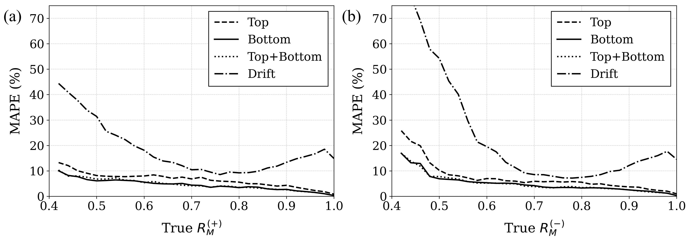
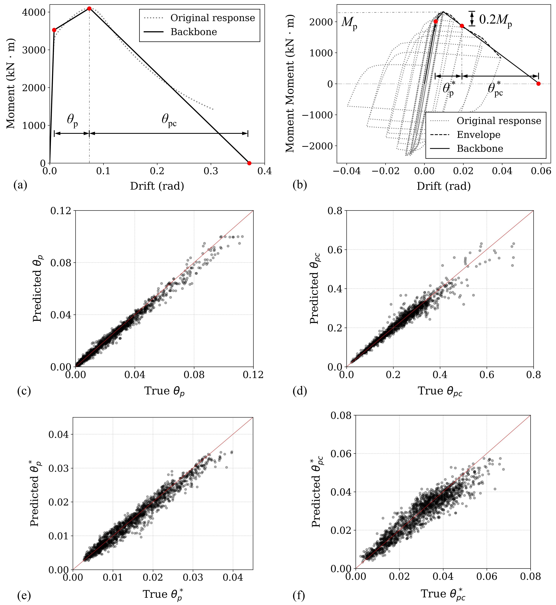

# Steel-3dPointCloud Database: examples of potential usage
This repository offers exemplar scripts demonstrating the potential applications of the Steel-3DPointCloud database across various fields. Please refer to ## link to the data paper ## for more detailed background information.

## Example 1

The first application of the database is the potential use of data-driven tools for the automated quantification of reserve capacity of steel columns. This repository provides a baseline model using K-nearest neighbors (KNN). The model that employs only the column bottom end point cloud as input provides the most accurate predictions, demonstrating an overall prediction error of 5.6% for $R_\mathrm{M}^{(+)}$ and 5.3% for $R_\mathrm{M}^{(-)}$ can be achieved for reserve capacities between 40% to 100%, as shown by the figure below.

    

To reproduce the results, first run `Prep_dataset.py` to extract information from the Steel-3DPointCloud database and save as several numpy files. Next, execute `KNN_1P.py`, `KNN_2P.py`, and `KNN_DR.py` to perform KNN-based reserve capacity quantification. Finally, use `KNN_plot.py` to visualize the results.

## Example 2

The second example illustrates how the database can be used to establish a data-driven surrogate for predicting typical deformation characteristics that are associated with the pre- and post-peak plastic rotation of a steel beam-column [(Lignos and Krawinkler 2011)], as shown by the figure below. The idea is to use various column geometrical and load properties, including $d/t_\mathrm{w}$, $b_\mathrm{f}/t_\mathrm{f}$, $L/d$, $L/r_\mathrm{y}$, $d$ and $P/P_\mathrm{y}$, as input to directly infer the column's plastic rotation parameters, $\theta_\mathrm{p}$, $\theta_\mathrm{pc}$, $\theta^{\*}_\mathrm{p}$ and $\theta^*_\mathrm{pc}$, under monotonic and cyclic loading. Here a baseline ML model is provided using a four-layer fully connected neural network with a per-layer drop out ratio of 0.3. It achieves an overall relative error of 10.8%, 5.3%, 11.0% and 13.5% for $\theta_\mathrm{p}$, $\theta_\mathrm{pc}$, $\theta^*_\mathrm{p}$ and $\theta^*_\mathrm{pc}$, respectively, on the test set.

    

To reproduce the results, first run `Prep_dataset_S.py`/`Prep_dataset_M.py` to extract information from the Steel-3DPointCloud database and save as several numpy files. Next, execute `main.py` to train the ML model. Finally, use `test.py` to visualize the results.

## Example 3

The third potential application of the database is its role in establishing geometric tolerances for the reuse potential of structural steel members [(Wen et al. 2023)]. Please directly run `GeoTol_Dsitribution.py` to reproduce the results in the paper.

## References

&nbsp;&nbsp;&nbsp;&nbsp;&nbsp;&nbsp; Lignos, D. G., & Krawinkler, H. (2011). Deterioration modeling of steel components in support of collapse prediction of steel moment frames under earthquake loading. *Journal of Structural Engineering*, *137*(11), 1291-1302.

&nbsp;&nbsp;&nbsp;&nbsp;&nbsp;&nbsp; Wen, C., Skiadopoulos, A., & Lignos, D. G. (2023). Geometric tolerances of welded connections with inelastic panel zones. In *Proceedings 10th European Conference on Steel and Composite Structures* (Vol. 6, pp. 1550-1555). Ernst & Sohn.

[(Lignos and Krawinkler 2011)]: https://ascelibrary.org/doi/full/10.1061/%28ASCE%29ST.1943-541X.0000376
[(Wen et al. 2023)]: https://onlinelibrary.wiley.com/doi/full/10.1002/cepa.2272
