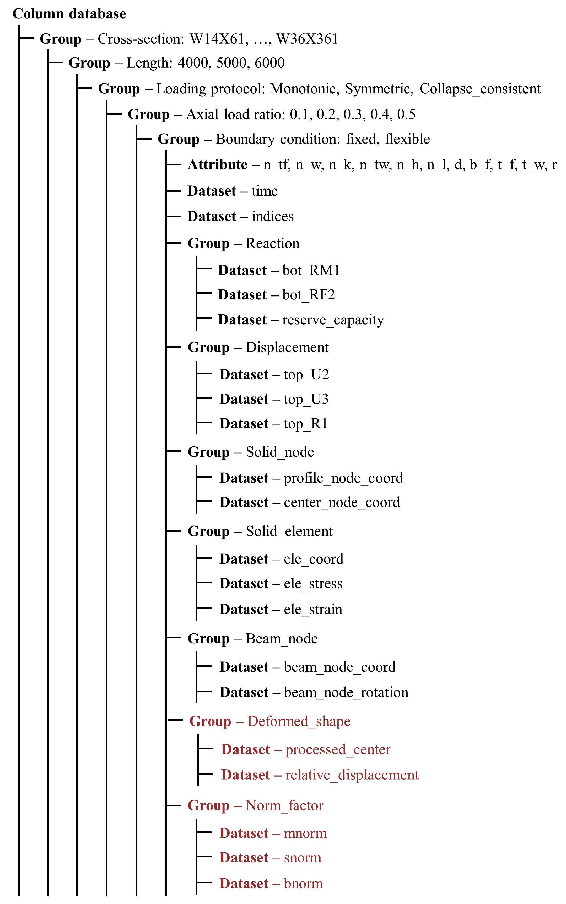
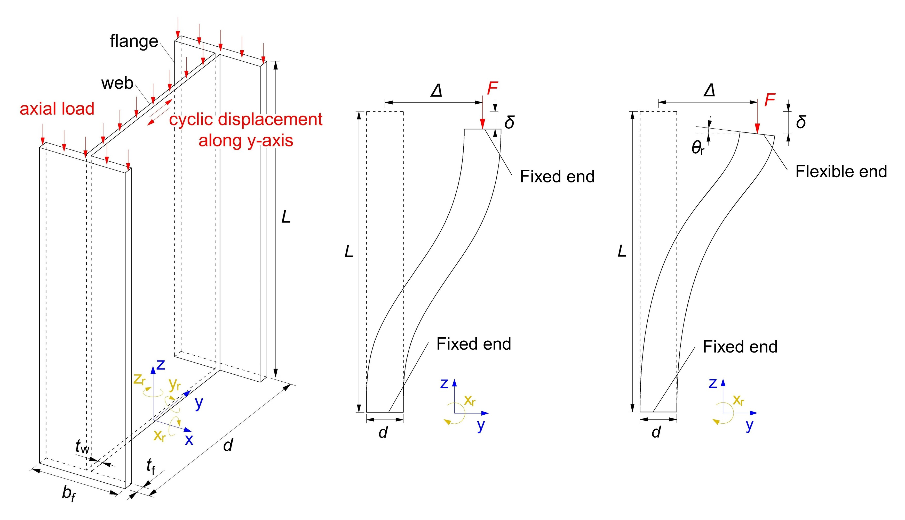
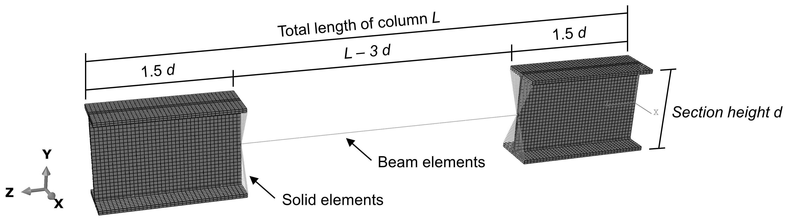
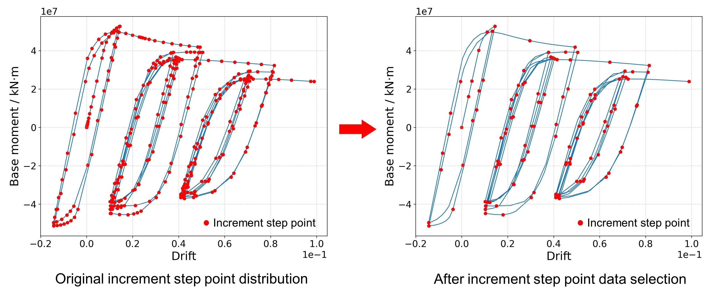
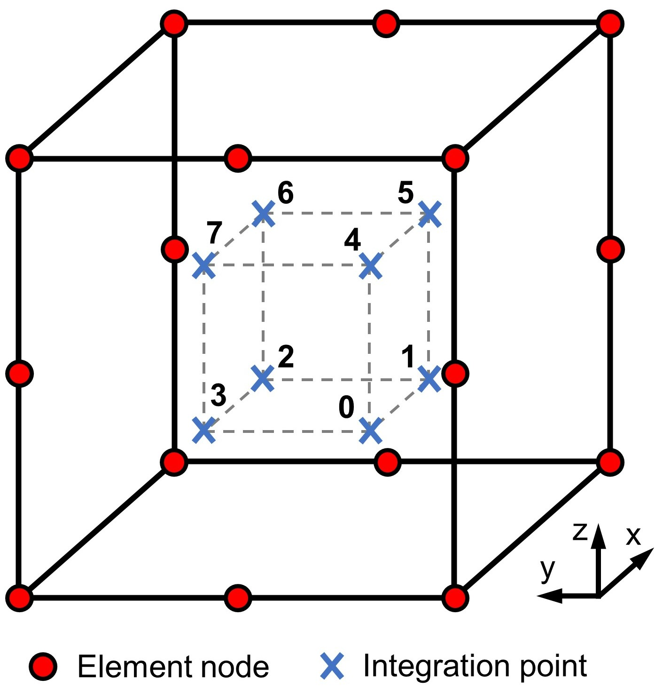

# Steel-3dPointCloud Database Processing and Structure
This repository contains scripts for feature engineering of the Steel-3DPointCloud database. Specifically, `Get_processed_centerline_PC.py` generates processed centerline point clouds, `Get_relative_difference_PC.py` generates relative displacement point clouds, and `Normalization_methods.py` calculates normalizations factors. The final version of the Steel-3DPointCloud database can be obtained by running these scripts on the raw version generated by `AutoGen`. The following sections provide an overview of the database structure and usage guidelines.

## Data storage structure

This database records information including point clouds, stress and strain fields and macroscopic behaviors, of I-shape hot-rolled steel columns under monotonic/cyclic obtained from numerical analyses with Multiple-Point Constraint (MPC) models [(Hartloper et al. 2022)]. The data is stored in [HDF5 format](https://www.h5py.org/), which has the following structure,

<p align="center">
    
</p>

Note that in the above figure, all the data colored IN black are raw data generated directly from `AutoGen`, and the rest colored in red are obtained by `FeatProc` through further feature processing.

## Metadata

Generally, a numerical model of column in the database can be located with five parameters, including (1) member section, (2) member length, (3) loading protocol, (4) axial load to yield strength ratio, (5) boundary, and accordingly there are five metadata groups in the database,

- **Section Group:** In this database, ASTM steel wide channel I-beam sections are considered.
  
- **Length Group:** For different standard sections, three different member lengths, `4000` mm, `5000` mm and `6000` mm, are considered.

- **Loading Protocol Group:** Three different loading protocols are considered for each member, including `Symmetric`, `Collapse_consistent` and `Monotonic`. Please check [(Elkady and Lignos 2018)] and [(Suzuki and Lignos 2020)] for detailed explanation of loading protocols used.

- **Axial Load to Yield Strength Ratio Group:** For each column model, axial compressive load is applied on the top. Different axial load to yield strength ratios are considered for each member, including `0.1`, `0.2`, `0.3`,  `0.4` and `0.5`.

- **Boundary Group:** All columns have fixed end boundaries at the bottom, while two types of boundary conditions are considered at the top end for each column, which are `Flexible` end and `Fixed` end. `Fixed` end at the top only allows z-direction free movement, and transverse displacement is applied along the y-axis, while `Flexible` end also make the column top rotate around x-axis. Please check [(Elkady and Lignos 2018)] for detailed explanation of flexible boundary condition.

<p align="center">
  
</p>

Accessing the HDF5 format database is easy by following the basic rule,

> Groups work like dictionaries, and datasets work like NumPy arrays.

For instance, if the user wants the data of a W21X101 section column with a length of 3500 mm, under an axial load to yield strength ratio of 0.2, with symmetric loading protocol and flexible boundary condition on the top end, the following code should be used,

```python
import h5py
column_database = h5py.File("column.hdf5", "r")
column_data = column_database['W21X101']['3500']['Symmetric']['0.2']['Flexible']
```

One can check the keys under the current group by,

```python
print(column_database.keys())
```

## Data definition and access

The MPC model used for database establishment is shown in the figure below. The two solid element segments can capture accurate deformation and stress strain contours of the buckled regions. These local information, as well as global moment - displacement data, are saved in the database in the form of HDF5 datasets shown in the table below. Additional geometrical and mesh information about the model is stored as attributes.

<p align="center">
  
</p>

For example, if the user wants to access attribute **t_f**, dataset **time** and dataset **ele_strain**, the following code should be used,

```python
n_h = column_data.attrs['t_f']
time = column_data['time']
ele_strain = column_data['Solid_element']['ele_strain']
```

It is meaningless to save all the data from all the increment steps after numerical simulation, as shown in the base moment - drift curve below, a lot of increment steps are very close and their results can be similar, so it is a waste of storage to save all the data. In this database, only point cloud data (coordinate, strain, stress) of the most representative increment steps is selected and saved, and the selected data's indices in the original matrix are saved in the vector **indices**. On the other hand, to keep the smoothness of macro-response of member, time, moment and displacement vectors still keep all the data from all increment steps.

<p align="center">
  
</p>

The **indices** vector establishes a link between point cloud data matrices and macro-time, moment and displacement data vectors. For example, if the user wants to know the base x-axis moment of column corresponding to a status of the **ele_strain[2]** strain matrix, the following code should be used,

```python
indices = column_data['indices']
current_bot_RM1 = column_data['Reaction']['bot_RM1'][indices[2]]
```

|**Datasets**             |**Type**    |**Description**                                                 |**Dimension**  |
|:---:                    |:---:       |:---:                    |:---:          |
|**n_tf**                 |Attribute   |number of elements along flange width        |     scalar          |
|**n_w**                  |Attribute   |number of elements along web length                    |       scalar        |
|**n_k**                  |Attribute   |number of elements at chamfering arc                    |       scalar        |
|**n_tw**                 |Attribute   |number of elements at flange thickness                    |        scalar       |
|**n_h**                  |Attribute   |number of elements at web thickness                    |      scalar         |
|**n_l**                  |Attribute   |number of elements along solid segment length                    |        scalar       |
|**d**                    |Attribute   |depth of section (mm)                    |          scalar     |
|**b_f**                  |Attribute   |width of section (mm)       |      scalar         |
|**t_f**                  |Attribute   |thickness of flange (mm)                    |     scalar          |
|**t_w**                  |Attribute   |thickness of web (mm)                    |         scalar      |
|**r**                    |Attribute   |chamfering radius (mm)                    |       scalar        |
|**time**                 |Dataset     |step time                    |       (nf, )         |
|**indices**                 |Dataset     |selected indices                    |       (nsf, )        |
|**top_RM1**              |Dataset     |top reaction moment around x-axis (N·mm)                  |       (nf, )        |
|**bot_RM1**              |Dataset     |bottom reaction moment around x-axis (N·mm)           |       (nf, )        |
|**reserve_capacity**     |Dataset     |reserve bearing capacities  (N·mm)                   |       (nf, nrc)       |
|**top_U2**               |Dataset     |top transverse displacement at y-direction (mm)                  |        (nf, )       |
|**top_U3**               |Dataset     |top axial displacement at z-direction (mm)              |      (nf, )         |
|**top_R1**               |Dataset     |top rotation around x-axis (rad)                   |       (nf, )        |
|**profile_node_coord**         |Dataset     |three-dimensional coordinates of nodes on outside profiles of solid element segment (mm) |(nsf, ne, nsp, nc)|
|**center_node_coord**          |Dataset     |three-dimensional coordinates of nodes on centerlines of solid element segment (mm)     |(nsf, ne, nsc, nc)|
|**ele_coord**            |Dataset     |coordinates of integration points (mm)                  |       (nsf, ne, ns, ni, nc)        |
|**ele_stress**           |Dataset     |three principal stress and Mises stress on integration points (MPa)     |          (nsf, ne, ns, ni, nps)     |
|**ele_strain**           |Dataset     |six plastic strain components on integration points                    |       (nsf, ne, ns, ni, npe)        |
|**beam_node_coord**      |Dataset     |three-dimensional coordinates of nodes on beam element segment (mm)    |      (nsf, nb, nc)         |
|**beam_node_rotation**   |Dataset     |three-dimensional rotations of nodes on beam element segment (rad)  |        (nsf, nb, nr)       |
|**processed_center**   |Dataset     |processed centerline point cloud  | (nsf, ne, np, nc)  |
|**relative_displacaement**   |Dataset     |relative displacement point cloud  |      (nsf, ne, np, nc)      |
|**mnorm**   |Dataset     |multi-factor normalization factors  |         (nc, )         |
|**snorm**   |Dataset     |unit-sphere normalization factors  | (nsf, ne, nc)  |
|**bnorm**   |Dataset     |plate buckling theory normalization factor  |       scalar       |
>**Notes:** <br>
>nf - total number of increment steps;
>nsf - number of selected increment steps;
>nrc -  number of reserve capacities, 2,  with index 0 denoting $R_{\rm M}^{(+)}$ and 1 denoting $R_{\rm M}^{(-)}$;
>ne - number of solid element segments, 2, with index 0 denoting the bottom and 1 denoting the top;
>nsp - number of nodes on the profile of each solid element segment;
>nc - number of coordinates considered, 3, with index 0, 1, 2 denoting x-, y- and z-coordinate respectively;
>nsc - number of nodes on the centerlines of each solid element segment;
>ns - number of solid elements on each solid element segment;
>ni - number of integration points on a solid element, 8;
>nps - number of stress outputs on each integration point, 4, with index 0, 1, 2, 3 representing maximum, intermediate, minimum principal stresses and Mises stress respectively;
>npe - number of plastic strain components on each integration point, 6, with index 0, 1, 2, 3, 4, 5 respectively denoting xx-, yy-, zz-, xy-, xz- and yz-direction plastic strain;
>nb - number of nodes on beam element segment;
>nr - number of rotations, 3, with index 0, 1, 2 respectively denoting rotation around x-, y- and z- axis;
>np - number of points in the processed centerline point cloud, 441 in this database.

Finally, it is shown that the **reserve_capacity** dataset has the two values for each increment step point. In the numerical analysis, the member can move either in the positive or negative direction according to its y-axis. Consequently, two reserve capacities are defined for the member: $$R^{(+)}_M$$ in positive direction and $$R^{(-)}_M$$ in the negative direction, denoting the maximum absolute normalized moment the member can achieve in each direction, i.e. the ratio of the current maximum moment bearing capacity to the maximum capacity of its undamaged state.

## Dataset indexing strategy

For convenient data extraction, node and element indices in the datasets are arranged in an organized way, and this section shows the indexing strategies.

**Solid element datasets**, including **ele_coord**, **ele_stress** and **ele_strain** generally have five dimensions,

-  The first dimension is the increment step number in numerical modeling.
   
- The second dimension is the location of the element, with an index 0 denoting an element at the bottom solid element end, and an index 1 denotes an element at the top segment.
  
- The third dimension is the element label in the specified solid element segment, which is explained in detail below.
  
- The fourth dimension is the integration point number in solid element, ranging from 0 to 7.

- The fifth dimension is the parameter on integration point. For coordinates, 0, 1, 2 denote x-, y-, z- global coordinates respectively; for stress, 0, 1, 2, 3 denote the first, second, third principal stress and Mises stress respectively; for strain, 0, 1, 2, 3, 4, 5 denote x-normal, y-normal, z-normal, xy-shear, xz-shear, yz-shear plastic strains respectively.

**Solid node datasets**, including **profile_node_coord** and **center_node_coord** generally have four dimensions,

-  The first dimension is the increment step number in numerical modeling.
   
- The second dimension is the location of the node, with an index 0 denoting a node at the bottom solid element end, and an index 1 denotes a node at the top segment.
  
- The third dimension is the node label in the specified solid element segment, which is explained in detail below.
  
-  The fourth dimension is the coordinates of node, and indices 0, 1, 2 denote x-, y-, z- global coordinates respectively.

**Beam node datasets**, including **beam_node_coord** and **beam_node_rotation** generally have three dimensions,

-  The first dimension is the increment step number in numerical modeling.
   
- The second dimension is the node label in beam element segment, which is indicated by its location. Generally the node label is smaller when the node's initial z coordinate is smaller.
  
-  The third dimension is the parameter on integration point. For coordinates, 0, 1, 2 denote x-, y-, z- global coordinates respectively; for rotations, 0, 1, 2 denote rotations around x-, y-, z- axes respectively.


<p align="center">
  
</p>

The indexing process of nodes and elements in a specified solid element segment always starts from the one with the smallest x, y and z global coordinates, then this process continues along z direction first. The labeling in z direction forms a "labelling line", and then,
- For profile nodes, the labelling line travels around the member clockwise to label all of them.
  
- For centerline nodes, the labeling line travels along bottom flange first, and then web and finally upper flange in the direction shown in the figure above.

- For solid elements, the labelling line first travels at thickness direction, then travels along the lower flange, web and upper flange step by step in a similar manner.

In addition, it should be noted that the labels of eight integration points in each element always follow the indexing rule shown in the figure below, depending on their relative position in the global coordinate system.

<p align="center">
    
</p>

By this indexing method, each node can be found easily with mesh attributes.  For example, if the user wants to print the initial x-coordinate of the green centerline node in the aforementioned figure, it is convenient to obtain it after knowing mesh attributes **n_w**, **n_k**, **n_tw** and **n_l**,

```python
n_w = column_data.attrs['n_w']
n_k = column_data.attrs['n_k']
n_tw = column_data.attrs['n_tw']
n_l = column_data.attrs['n_l']
center_node = column_data['Solid_node']['center_node_coord']
node_index = (2 * n_w + n_k + n_tw) * (n_l + 1)
print(center_node[0, 0, node_index, 0])
```


## References
&nbsp;&nbsp;&nbsp;&nbsp;&nbsp;&nbsp; Elkady, A., & Lignos, D. G. (2018). Full-scale testing of deep wide-flange steel columns under multiaxis cyclic loading: Loading sequence, boundary effects, and lateral stability bracing force demands. Journal of Structural Engineering, 144(2), 04017189.

&nbsp;&nbsp;&nbsp;&nbsp;&nbsp;&nbsp; Hartloper, A. R., de Castro e Sousa, A., & Lignos, D. G. (2022). Warping-inclusive kinematic coupling in mixed-dimension macro models for steel wide flange beam columns. Journal of Structural Engineering, 148(2), 04021253.

&nbsp;&nbsp;&nbsp;&nbsp;&nbsp;&nbsp; Suzuki, Y., & Lignos, D. G. (2020). Development of collapse‐consistent loading protocols for experimental testing of steel columns. Earthquake Engineering & Structural Dynamics, 49(2), 114-131.

[(Elkady and Lignos 2018)]: https://ascelibrary.org/doi/full/10.1061/(ASCE)ST.1943-541X.0001937
[(Suzuki and Lignos 2020)]: https://onlinelibrary.wiley.com/doi/full/10.1002/eqe.3225
[(Hartloper et al. 2022)]: https://ascelibrary.org/doi/full/10.1061/%28ASCE%29ST.1943-541X.0003211
